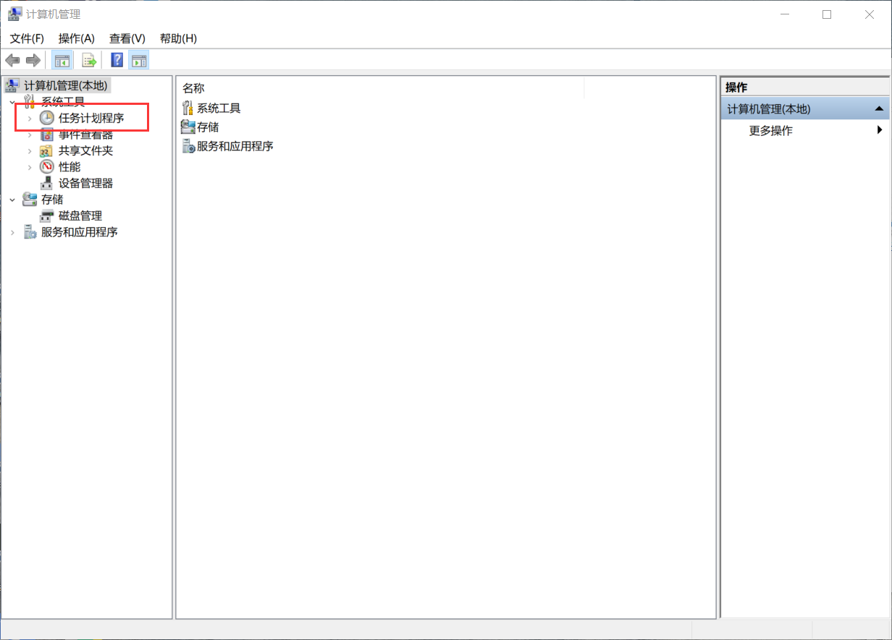
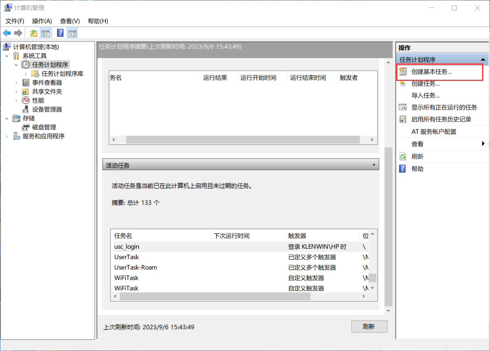
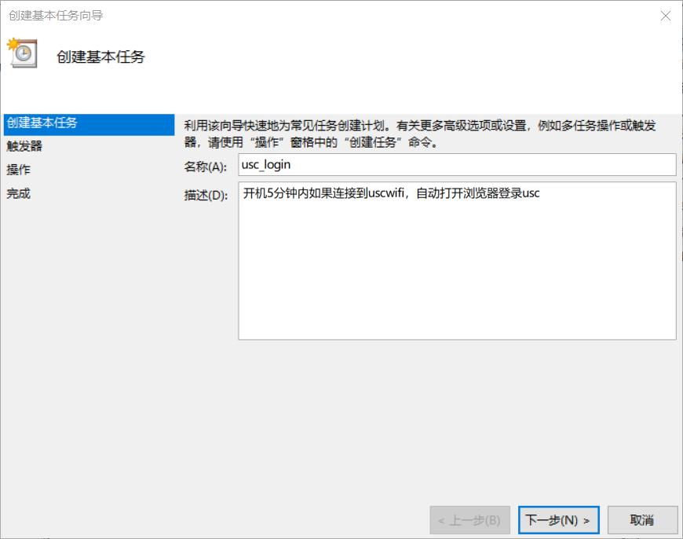
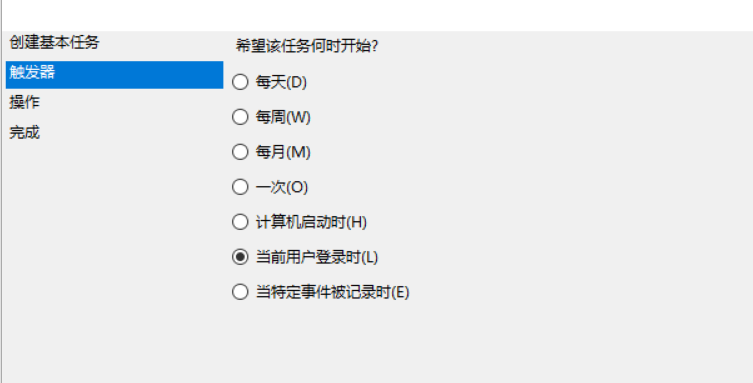
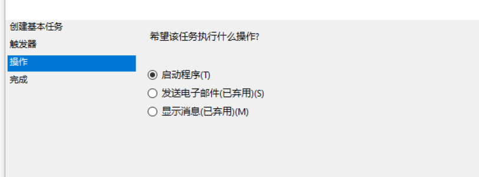
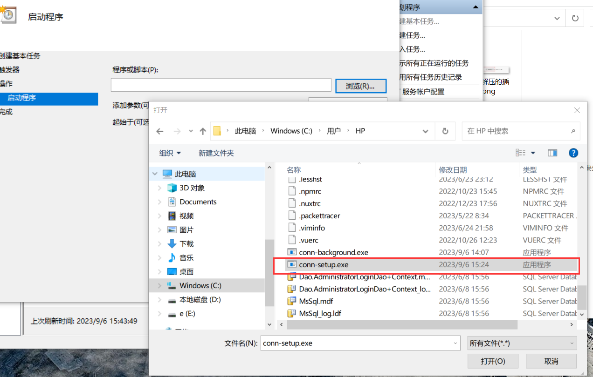

# 简介
该程序实现电脑开机后台自动连接usc网络，连接成功后发送通知到用户，考虑到校园网只支持一台设备登录，故该程序只要成功一次校园网就立即结束

本项目是基于[此项目](https://github.com/Mmx233/BitSrunLoginGo)做二次开发，针对usc校园网调整参数，并增加了连接情况的通知。

# 使用
- 从最新的**release**中下载对应系统的版本，并解压到任意位置
- 打开userinfo.yaml文件，输入账号密码
-  启动程序，如果出现无法读取配置文件，则运行 **usc-conn.exe -f <配置文件路径>**
- 设置开机自启

# windows设置开机自启

1. 桌面右键此电脑，点击管理,或者搜索计算机管理

2. 选择任务计划程序

   

3. 创建基本任务

   

**注意:** 选择程序后，要添加配置文件位置： usc-conn.exe -f <配置文件位置>
